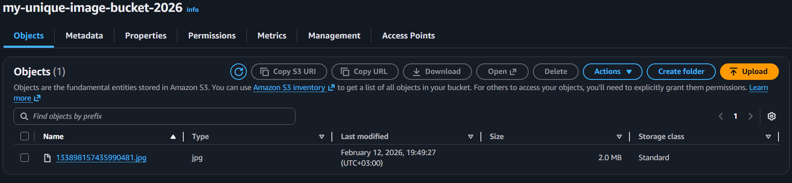
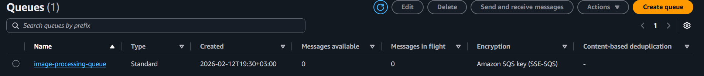
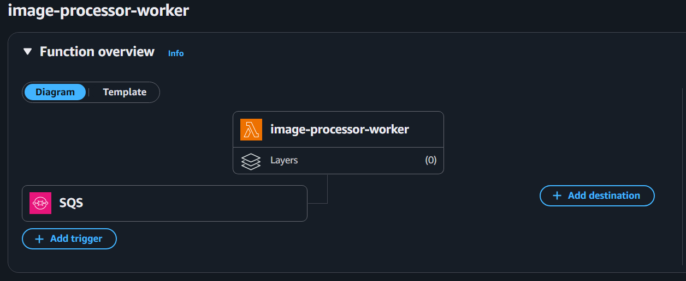
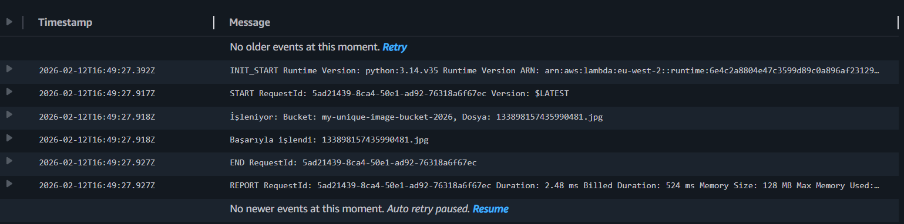
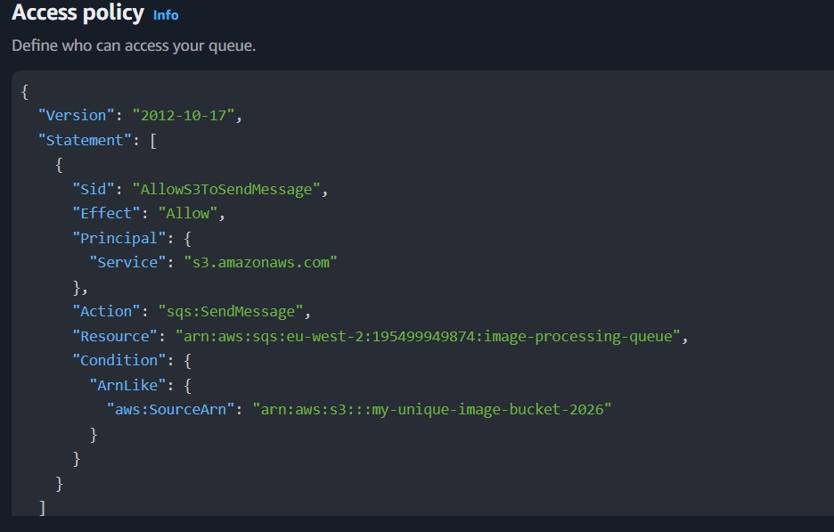

# Kesintisiz-Veri-Isleme-Altyapisi

S3 (Giriş) Kullanıcı bir görsel yükler.

S3 Event Notification Yükleme gerçekleştiğinde SQS'e bir event mesajı gönderir.

SQS (Kuyruk) Mesajları Lambda işleyene kadar güvenli bir şekilde saklar (Buffer).

Lambda (İşlemci) Kuyruktaki mesajları alır, S3'teki nesneye erişir ve işleme mantığını yürütür.

# Kullanılan Teknolojiler
AWS S3 Depolama ve Event tetikleyici.

AWS SQS Mesaj kuyruğu (Decoupling).

AWS Lambda Serverless işlem birimi (Python 3.12).

IAM Servisler arası Least Privilege (En az yetki) erişim politikaları.

# Kurulum Adımları (AWS Console)
1. SQS Kuyruğu Oluşturma
image-processing-queue adında bir Standard Queue oluşturuldu.

Access Policy güncellenerek S3'ün SendMessage yetkisi tanımlandı.

2. S3 ve Event Notification
Bir bucket oluşturuldu ve Properties sekmesinden All object create events için SQS hedef gösterilerek bir trigger tanımlandı.

3. IAM Rolü
Lambda'nın SQS'ten mesaj okuyabilmesi ve CloudWatch'a log yazabilmesi için gerekli politikalar (AWSLambdaSQSQueueExecutionRole) tanımlandı.

4. Lambda Fonksiyonu
Python tabanlı fonksiyon, SQS'ten gelen JSON gövdesini (body) parse ederek dosya bilgilerini alacak şekilde yapılandırıldı.

SAA Perspektifi Neden Bu Mimari
Decoupling (Bağımsızlık) S3 ile Lambda arasına SQS koyarak, Lambda'da oluşabilecek bir hata veya gecikme durumunda veri kaybını önledim.

Scalability (Ölçeklenebilirlik) Binlerce görsel aynı anda yüklense bile SQS bu yükü göğüsler ve Lambda kapasitesi dahilinde mesajları işler.

Cost Efficiency Serverless bileşenler kullanılarak sadece işlem yapıldığında ücret ödenmesi sağlandı (Free-Tier dostu).

